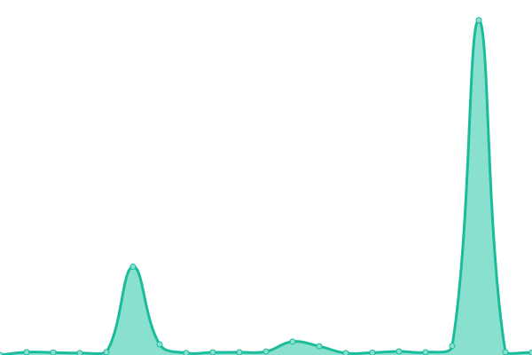

# [📈 Live Status](https://ccris02.github.io/uptime): <!--live status--> **🟩 All systems operational**

This repository contains the open-source uptime monitor and status page for [ccris02](https://polkaDIR.com), powered by [Upptime](https://github.com/upptime/upptime).

With [Upptime](https://upptime.js.org), you can get your own unlimited and free uptime monitor and status page, powered entirely by a GitHub repository. We use [Issues](https://github.com/ccris02/uptime/issues) as incident reports, [Actions](https://github.com/ccris02/uptime/actions) as uptime monitors, and [Pages](https://ccris02.github.io/uptime) for the status page.

<!--start: status pages-->
<!-- This summary is generated by Upptime (https://github.com/upptime/upptime) -->
<!-- Do not edit this manually, your changes will be overwritten -->
<!-- prettier-ignore -->
| URL | Status | History | Response Time | Uptime |
| --- | ------ | ------- | ------------- | ------ |
|  [kusama.w3f.community/candidate/address](https://kusama.w3f.community/candidate/Dq97kmsJXGTciU1eMXZMAp4D41Y9e7kQ4hmFBfZW7YD4CCf) | 🟩 Up | [kusama-w3f-community-candidate-address.yml](https://github.com/ccris02/1KV_API/commits/HEAD/history/kusama-w3f-community-candidate-address.yml) | 

 3097ms
     
 | 

<a href="https://ccris02.github.io/1KV_API/history/kusama-w3f-community-candidate-address">81.08%</a>
    

|  [kusama.w3f.community/erapoints/address](https://kusama.w3f.community/erapoints/Dq97kmsJXGTciU1eMXZMAp4D41Y9e7kQ4hmFBfZW7YD4CCf) | 🟩 Up | [kusama-w3f-community-erapoints-address.yml](https://github.com/ccris02/1KV_API/commits/HEAD/history/kusama-w3f-community-erapoints-address.yml) | 

 5889ms
     
 | 

<a href="https://ccris02.github.io/1KV_API/history/kusama-w3f-community-erapoints-address">76.61%</a>
    

|  [kusama.w3f.community/score/address](https://kusama.w3f.community/score/Dq97kmsJXGTciU1eMXZMAp4D41Y9e7kQ4hmFBfZW7YD4CCf) | 🟩 Up | [kusama-w3f-community-score-address.yml](https://github.com/ccris02/1KV_API/commits/HEAD/history/kusama-w3f-community-score-address.yml) | 

 1304ms
     
 | 

<a href="https://ccris02.github.io/1KV_API/history/kusama-w3f-community-score-address">76.90%</a>
    

|  [kusama.w3f.community/candidates](https://kusama.w3f.community/candidates) | 🟩 Up | [kusama-w3f-community-candidates.yml](https://github.com/ccris02/1KV_API/commits/HEAD/history/kusama-w3f-community-candidates.yml) | 

 2805ms
     
 | 

<a href="https://ccris02.github.io/1KV_API/history/kusama-w3f-community-candidates">76.00%</a>
    

|  [kusama.w3f.community/erastats](https://kusama.w3f.community/erastats) | 🟩 Up | [kusama-w3f-community-erastats.yml](https://github.com/ccris02/1KV_API/commits/HEAD/history/kusama-w3f-community-erastats.yml) | 

 947ms
     
 | 

<a href="https://ccris02.github.io/1KV_API/history/kusama-w3f-community-erastats">76.06%</a>
    

|  [kusama.w3f.community/locationstats](https://kusama.w3f.community/locationstats) | 🟩 Up | [kusama-w3f-community-locationstats.yml](https://github.com/ccris02/1KV_API/commits/HEAD/history/kusama-w3f-community-locationstats.yml) | 

 1234ms
     
 | 

<a href="https://ccris02.github.io/1KV_API/history/kusama-w3f-community-locationstats">75.62%</a>
    

|  [polkadot.w3f.community/candidate/address](https://polkadot.w3f.community/candidate/149riLdwAVzXg7Cm88RcXhbuFi3zUgwrGsJSSPjC47PRxHQW) | 🟩 Up | [polkadot-w3f-community-candidate-address.yml](https://github.com/ccris02/1KV_API/commits/HEAD/history/polkadot-w3f-community-candidate-address.yml) | 

 2687ms
     
 | 

<a href="https://ccris02.github.io/1KV_API/history/polkadot-w3f-community-candidate-address">50.33%</a>
    

|  [polkadot.w3f.community/erapoints/address](https://polkadot.w3f.community/erapoints/149riLdwAVzXg7Cm88RcXhbuFi3zUgwrGsJSSPjC47PRxHQW) | 🟩 Up | [polkadot-w3f-community-erapoints-address.yml](https://github.com/ccris02/1KV_API/commits/HEAD/history/polkadot-w3f-community-erapoints-address.yml) | 

 967ms
     
 | 

<a href="https://ccris02.github.io/1KV_API/history/polkadot-w3f-community-erapoints-address">46.96%</a>
    

|  [polkadot.w3f.community/score/address](https://polkadot.w3f.community/score/149riLdwAVzXg7Cm88RcXhbuFi3zUgwrGsJSSPjC47PRxHQW) | 🟩 Up | [polkadot-w3f-community-score-address.yml](https://github.com/ccris02/1KV_API/commits/HEAD/history/polkadot-w3f-community-score-address.yml) | 

 458ms
     
 | 

<a href="https://ccris02.github.io/1KV_API/history/polkadot-w3f-community-score-address">43.57%</a>
    

|  [polkadot.w3f.community/candidates](https://polkadot.w3f.community/candidates) | 🟩 Up | [polkadot-w3f-community-candidates.yml](https://github.com/ccris02/1KV_API/commits/HEAD/history/polkadot-w3f-community-candidates.yml) | 

 1353ms
     
 | 

<a href="https://ccris02.github.io/1KV_API/history/polkadot-w3f-community-candidates">43.53%</a>
    

|  [polkadot.w3f.community/erastats](https://polkadot.w3f.community/erastats) | 🟩 Up | [polkadot-w3f-community-erastats.yml](https://github.com/ccris02/1KV_API/commits/HEAD/history/polkadot-w3f-community-erastats.yml) | 

 557ms
     
 | 

<a href="https://ccris02.github.io/1KV_API/history/polkadot-w3f-community-erastats">43.82%</a>
    

|  [polkadot.w3f.community/locationstats](https://polkadot.w3f.community/locationstats) | 🟩 Up | [polkadot-w3f-community-locationstats.yml](https://github.com/ccris02/1KV_API/commits/HEAD/history/polkadot-w3f-community-locationstats.yml) | 

 572ms
     
 | 

<a href="https://ccris02.github.io/1KV_API/history/polkadot-w3f-community-locationstats">45.63%</a>
    

|  [Test site](https://google.com) | 🟩 Up | [test-site.yml](https://github.com/ccris02/1KV_API/commits/HEAD/history/test-site.yml) | 

 151ms
     
 | 

<a href="https://ccris02.github.io/1KV_API/history/test-site">100.00%</a>
    

<!--end: status pages-->

[**Visit our status website →**](https://ccris02.github.io/uptime)

## 📄 License

- Powered by: [Upptime](https://github.com/upptime/upptime)
- Code: [MIT](./LICENSE) © [ccris02](https://polkaDIR.com)
- Data in the `./history` directory: [Open Database License](https://opendatacommons.org/licenses/odbl/1-0/)
